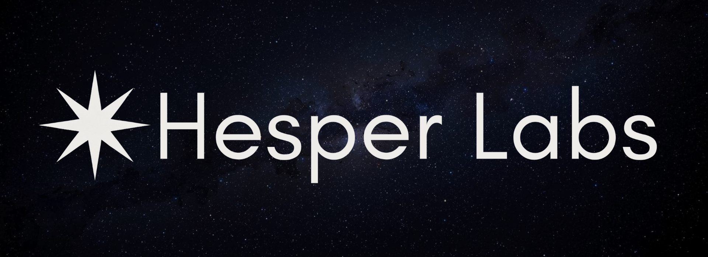

<div align="center">

# 

# Simple Token

**A Byte Pair Encoding (BPE) tokenizer trainer for multilingual text processing**

[](https://www.python.org/)
[](https://github.com/omertarikyilmaz/simpletoken)
[](https://huggingface.co/omertarikyilmaz)
[](https://colab.research.google.com/drive/1xkoGYWcTREahjW8VJHzGhRxd9H7Wp8Vb?usp=sharing)

</div>

---

## Overview

**Simple Token** is a Byte Pair Encoding (BPE) tokenizer implementation developed by Hesper Labs. This project provides a comprehensive framework for building custom tokenization vocabularies from raw text, with particular emphasis on supporting non-English languages and multilingual text processing.

The implementation follows the standard BPE algorithm, operating directly on UTF-8 byte sequences to ensure universal language support. By working at the byte level, the tokenizer can handle any language that can be represented in UTF-8 encoding, including languages with complex character sets such as Turkish, Arabic, Chinese, Japanese, and others.

---

## Theoretical Foundation

### Byte Pair Encoding

Byte Pair Encoding is a data compression technique that has been adapted for subword tokenization in natural language processing. The algorithm iteratively merges the most frequent pairs of consecutive bytes (or tokens) in a corpus, gradually building a vocabulary that captures common patterns in the text.

### UTF-8 Encoding

The choice of UTF-8 as the underlying encoding scheme is fundamental to the multilingual capabilities of this tokenizer. UTF-8 provides:

- **Universal Coverage**: Encodes the entire Unicode character set, supporting all modern languages
- **Backward Compatibility**: Maintains full compatibility with ASCII, ensuring seamless processing of English and other ASCII-based texts
- **Variable-Length Encoding**: Efficiently represents characters using 1-4 bytes, optimizing storage for multilingual corpora
- **Wide Adoption**: The de facto standard for web content and modern text processing systems

### Multilingual Tokenization

Traditional tokenization approaches often struggle with languages that have different morphological structures, character sets, or writing systems. By operating at the byte level through UTF-8 encoding, this implementation provides a language-agnostic approach to tokenization. This enables:

- Consistent tokenization across different languages
- Preservation of language-specific character representations
- Efficient handling of mixed-language texts
- Support for languages with complex character compositions

---

## Features

### Core Functionality

- **Pure Python Implementation**: Zero external dependencies, ensuring portability and ease of integration
- **UTF-8 Byte-Level Processing**: Direct operation on UTF-8 byte sequences for universal language support
- **Frequency-Based Vocabulary Building**: Statistical analysis of byte pair frequencies to construct optimal vocabularies
- **Multiple Export Formats**: JSON and plain text vocabulary formats for various use cases

### Multilingual Support

The tokenizer is specifically designed to assist with tokenization tasks for languages beyond English. By leveraging UTF-8 encoding and byte-level operations, it can effectively process:

- Languages with extended character sets (Turkish, German, French, Spanish, etc.)
- Languages with non-Latin scripts (Arabic, Hebrew, Greek, Cyrillic, etc.)
- Languages with ideographic writing systems (Chinese, Japanese, Korean)
- Mixed-language corpora containing multiple languages

---

## Architecture

The tokenization process follows a structured pipeline:

```
Text Input → UTF-8 Encoding → Byte Pair Analysis → Vocabulary Construction → Format Export
```

### Process Steps

1. **Text Analysis**: Statistical analysis of input text including character counts, word counts, and byte-level metrics
2. **Byte Pair Extraction**: Identification of all consecutive byte pairs and frequency calculation
3. **Pair Frequency Sorting**: Ranking of byte pairs by frequency to identify the most common patterns
4. **Vocabulary Construction**: Building vocabulary from 256 base bytes plus the most frequent byte pairs up to the specified vocabulary size
5. **Visualization**: Display of vocabulary tokens with their byte representations and decoded string forms
6. **Format Export**: Exporting vocabulary in structured formats (JSON) and human-readable text formats

---

## Quick Start

### Installation

Clone the repository:

```bash
git clone https://github.com/omertarikyilmaz/simpletoken.git
cd simpletoken
```

### Usage

Prepare your text corpus by placing UTF-8 encoded text files in the `data/input/` directory. The default configuration uses a Turkish text corpus, demonstrating the multilingual capabilities of the tokenizer.

To specify a different input file, modify the `FILE_PATH` variable in `main.py`:

```python
FILE_PATH = "data/input/your_corpus.txt"
VOCAB_SIZE = 300
```

Execute the tokenizer:

```bash
python3 main.py
```

The pipeline generates:

- `vocab.json`: Structured vocabulary in JSON format with token IDs, UTF-8 byte sequences, and decoded strings
- `tokens.vocab`: Human-readable plain text vocabulary file
- Console output: Detailed statistics and step-by-step processing information

---

## Project Structure

```
simpletoken/
├── data/
│   ├── input/
│   │   └── insan_ne_ile_yasar.txt    # Input corpus
│   ├── output/
│   │   ├── vocab.json               # JSON vocabulary
│   │   └── tokens.vocab              # Plain text vocabulary
│   └── img/
│       └── hesperlabs.png            # Logo
├── simpletoken/
│   ├── __init__.py                   # Package exports
│   └── tokenizer.py                  # Core BPE implementation
├── main.py                           # CLI entry point
├── simpletoken.ipynb                 # Interactive tutorial
└── README.md                         # This file
```

---

## Technical Details

### Vocabulary Construction

The vocabulary is constructed in two phases:

1. **Base Vocabulary**: Initial vocabulary consists of all 256 possible byte values (0-255), providing complete coverage of the UTF-8 byte space.

2. **Pair Merging**: The algorithm identifies the most frequent consecutive byte pairs in the corpus and adds them to the vocabulary. The number of pairs added is determined by the target vocabulary size minus the base 256 bytes.

### Token Representation

Each token in the vocabulary is represented by:
- **Token ID**: Unique integer identifier
- **UTF-8 Byte Sequence**: The raw byte values that constitute the token
- **Decoded String**: The human-readable string representation (when valid UTF-8)

### Example Output

```json
[
  {
    "token_id": 0,
    "utf8_bytes": [0],
    "string": "\x00"
  },
  {
    "token_id": 256,
    "utf8_bytes": [196, 177],
    "string": "ı"
  }
]
```

---

## Interactive Learning

A comprehensive Jupyter notebook (`simpletoken.ipynb`) is provided for educational purposes. The notebook includes:

- Detailed theoretical explanations of BPE and UTF-8 encoding
- Step-by-step code implementations
- Visual examples and demonstrations
- Practical exercises

The notebook is compatible with Google Colab and local Jupyter environments.

**Access the interactive notebook on Google Colab:** [Open in Colab](https://colab.research.google.com/drive/1xkoGYWcTREahjW8VJHzGhRxd9H7Wp8Vb?usp=sharing)

---

## Contributing

This repository is maintained by **Hesper Labs**.

Contributions are welcome. For significant changes, please open an issue first to discuss your proposed modifications.

---

## License

**Hesper Labs © 2025**

The included text corpus is distributed as received from public sources. Ensure any replacement corpora are appropriately licensed for your use case.

---

<div align="center">

**Developed by [Hesper Labs](https://hesperlabs.com/)**

[GitHub](https://github.com/omertarikyilmaz/simpletoken) | [Hugging Face](https://huggingface.co/omertarikyilmaz) | [YouTube](https://www.youtube.com/channel/UC5cpy2SbdejgEXTaNALpTWg) | [Contact](https://hesperlabs.com/)

</div>
